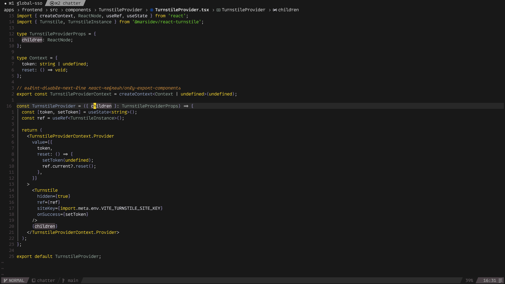
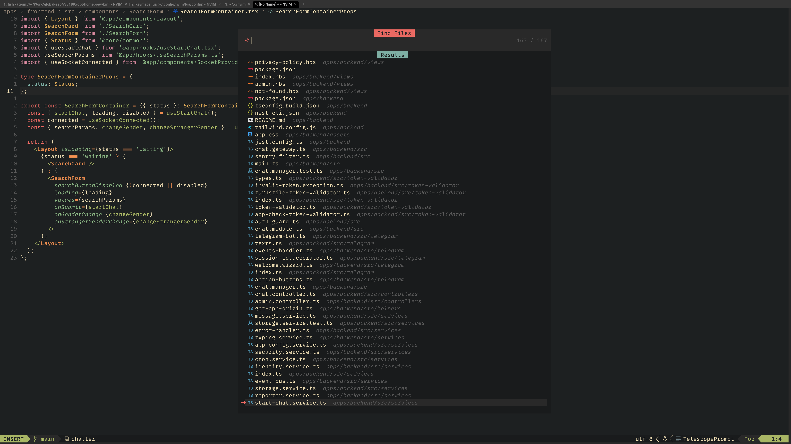
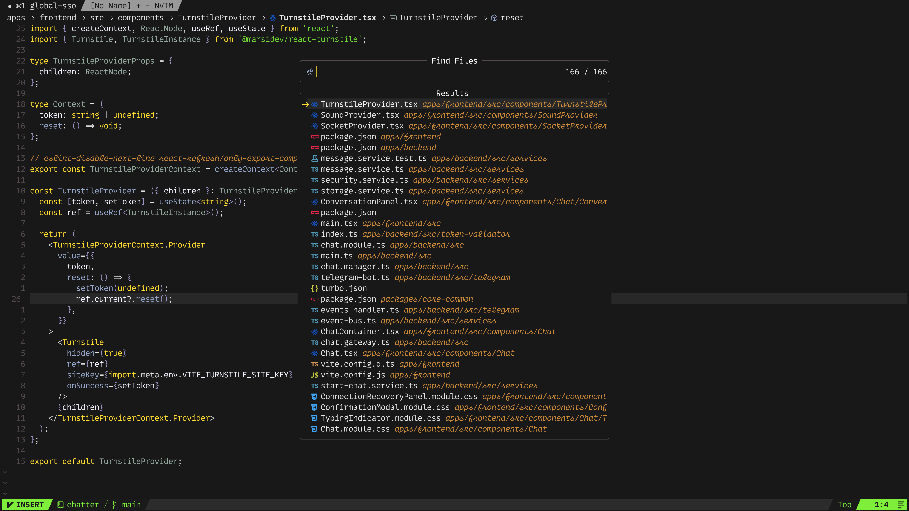

# My neovim config

Inspired by https://github.com/adibhanna/nvim

# Plugins

- auto-session.lua
- autocomplete.lua
- dropbar.lua
- colorizer.lua
- colorscheme.lua
- comments.lua
- copilot.lua
- dashboard.lua
- extra.lua
- formatter.lua
- git-signs.lua
- glance.lua
- lazygit.lua
- lsp.lua
- lualine.lua
- mini-indentscope.lua
- mini.lua
- noice.lua
- notify.lua
- nvim-surround.lua
- oil.lua
- snacks
- template-string.lua
- todo-comments.lua
- treesitter.lua
- which-key.lua

# Screenshots

